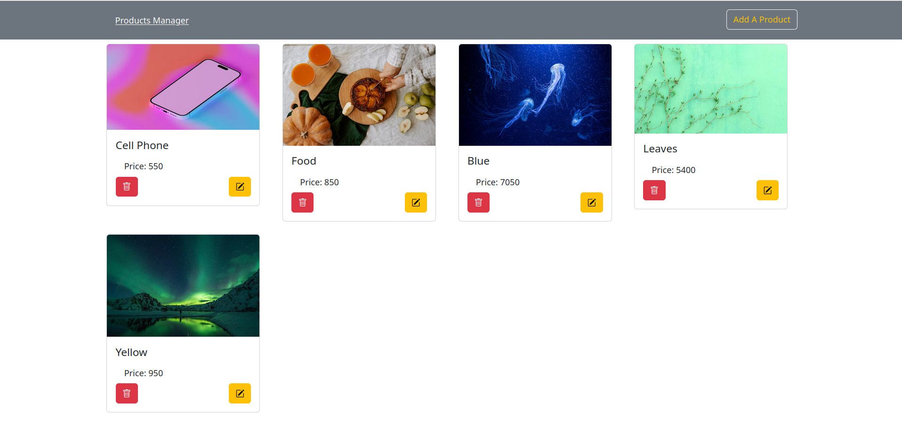

# Product_Manager

A simple CRUD (Create, Read, Update, Delete) application for managing products, built with the **MERN stack** and styled with **Bootstrap**. This project was created for learning purposes to practice full-stack development without external state management.



## 🛠️ Tech Stack

- **Frontend**: React (Vite), Bootstrap
- **Backend**: Node.js, Express
- **Database**: MongoDB (via Mongoose)
- **Tools**: Axios (HTTP client)

## 🚀 Features

- View all products
- Add a new product
- Edit an existing product
- Delete a product
- Responsive UI using Bootstrap
- Full-stack integration (frontend + backend)

## 🔧 Setup & Running Locally

## 1. Clone the repository
```bash
git clone https://github.com/MuhammadFarouk12/Product_Manager.git
cd Product_Manager
```
## 2. Set up the Backend 

- Navigate to the backend folder: 
```bash
cd backend
```
- Create a .env file: 
```env
DB_URL=your_mongodb_connection_string
PORT=8080
```
- Install dependencies and start the server: 
## 3. Set up the Frontend 
```bash
cd frontend
```
- Install dependencies and start the app: 
```bash
npm install
npm run dev
```
## 📝 Notes 
- No external state management library (e.g., Redux) is used — state is managed with React’s `useState` and `useContext`.
- The app is for learning purposes only, ideal for beginners exploring full-stack development with MERN.
- Backend runs on `http://localhost:8080`, frontend on `http://localhost:5173`.

## 🙌 Contributions 

> This project is open for learning and experimentation.
Feel free to fork, improve, or use it as a base for your own practice. 
